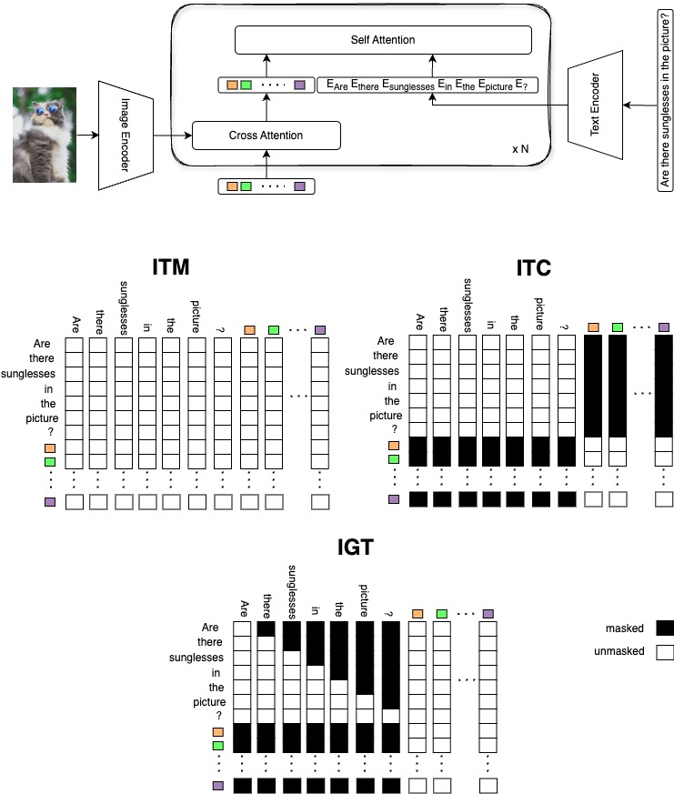
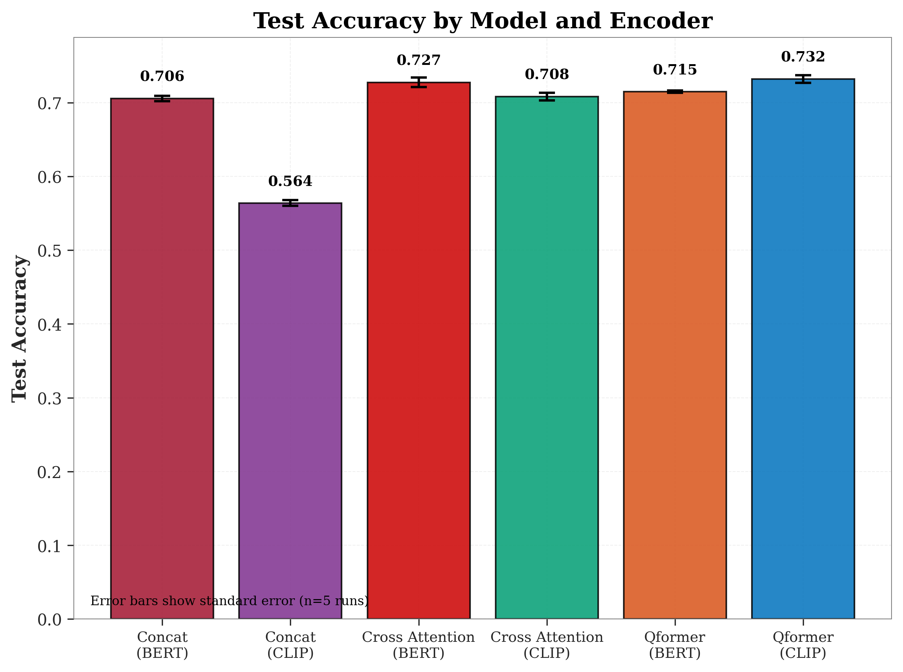

# VQA Model Comparison: QFormer, Cross Attention & Concat

This repository presents a comparative study of three deep learning architectures for Visual Question Answering (VQA) on a binary yes/no classification dataset.
A detailed step-by-step guide to our Q-Former implementation is available in [this Medium article](https://medium.com/@ofekirsh/build-blip-2-step-by-step-59dc5a041827).
For more context, refer to the original [BLIP-2 paper](https://lnkd.in/dbFZtHqk) which inspired this work.


<p align="center">
  
</p>

## Project Overview

The goal is to benchmark the following models:
- **QFormer**: A multi-task transformer with cross-modal attention and diverse objectives.
- **Cross Attention**: A model that directly applies cross-attention between visual and textual embeddings.
- **Concat Model**: A simpler baseline concatenating visual and text features before classification.

Each model supports two encoder types:
- **CLIP**: For both image and text.
- **BERT + ViT**: BERT for text and ViT-CLIP for image encoding.

## Dataset

The dataset used for this project was sourced from the following repository:
[Visual_Question_Answering by dinhquy-nguyen-1704](https://github.com/dinhquy-nguyen-1704/Visual_Question_Answering)


- **Train**: 7,846 samples  
- **Validation**: 1,952 samples  
- **Test**: 2,022 samples

## Installation

```bash
git clone https://github.com/orshkuri/vqa-model-comparison.git
cd vqa-model-comparison
python -m venv venv
source venv/bin/activate  # On Windows use: venv\Scripts\activate
pip install -r requirements.txt
```

## Usage

### Run All Experiments

```bash
python scripts/run.py --gpus 0,1 --models all --encoders all
```

You can customize the script using the following command-line arguments:

| Argument | Description | Default |
|----------|-------------|---------|
| `--results_dir` | Directory to save results | `../results` |
| `--models_dir` | Directory to save trained models | `../saved_models` |
| `--config_dir` | Directory containing model config files | `../configs` |
| `--data_dir` | Directory containing dataset files | `../data/vqa` |
| `--gpus` | Comma-separated list of GPU IDs to use | `0` |
| `--models` | Which models to run (`all`, `qformer`, `cross_attention`, `concat`) | `all` |
| `--encoders` | Which text encoders to use (`all`, `clip`, `bert`) | `all` |
| `--num_runs` | Number of runs per experiment | `5` |
| `--base_seed` | Base seed for random number generation | `42` |
| `--save_learning_curves` | Save learning curves for the first run (`true` or `false`) | `True` |
| `--generate_plots` | Generate plots after experiments (`true` or `false`) | `True` |

#### Example with Custom Parameters

```bash
python scripts/run.py --gpus 1 --models cross_attention --encoders clip --num_runs 3 --base_seed 123 --save_learning_curves True --generate_plots True
```
---

### Generate Comparison Plots

```bash
python scripts/make_plots.py --results_dir results --output_dir plots
```
You can customize the script using the following command-line arguments:

| Argument | Description | Default |
|----------|-------------|---------|
| `--results_dir` | Directory containing results files | `../results` |
| `--output_dir` | Directory to save generated plots | `../plots` |

#### Example with Custom Parameters

```bash
python scripts/make_plots.py --results_dir ../results --output_dir ../plots
```


## Results and Visualizations
<p align="center">
  
</p>


### QFormer
Multi-objective model using:
- Answer classification
- Image-Text Contrastive (ITC)
- Image-Text Matching (ITM)
- Image-Grounded Text (IGT)

### Cross Attention
Focuses on cross-attention mechanisms between image and question embeddings.

### Concat Model
Simple concatenation of features followed by classification layers.

## License
Distributed under the MIT License. See `LICENSE` for more information.
